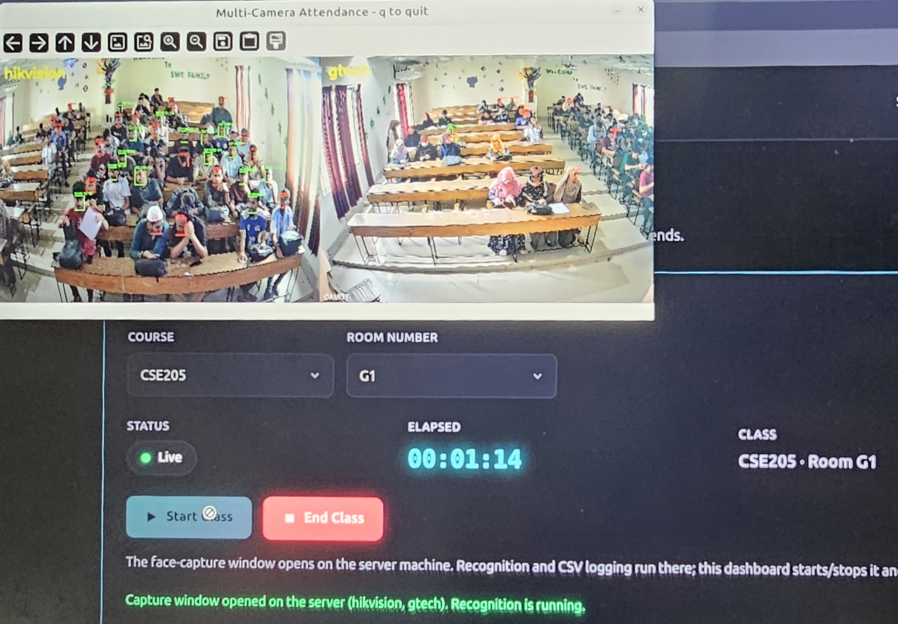

# Smart Attendance System 🎓

An **Automatic classroom attendance system** that recognizes students from live
CCTV / IP cameras and records attendance automatically - no roll call, no
fingerprint scanner, no manual entry.

A teacher signs in --> picks a course and room --> and clicks **Start Class**. The
system watches the room through the room's cameras, recognizes every enrolled
student's face in real time, and produces a clean attendance report (who was
present, when they arrived, and when they left).

---

## 🎥 Demo



> Recognizing multiple students live from a wired Hikvision IP camera and logging
> their attendance automatically.

---

## ✨ Features

- **Real-time face recognition** using state-of-the-art **ArcFace** (deep learning)
- **Recognizes many students at once** in a single camera frame
- **Multi-camera support** — cover a whole classroom with several cameras at once,
  shown side by side, results merged automatically
- **Works with IP / CCTV cameras** over RTSP (Hikvision, XiongMai, etc.) and phone
  cameras over Wi-Fi
- **Per-room camera configuration** stored in **MongoDB** — pick a room, it opens
  that room's cameras
- **Web dashboard** for teachers (login → start/stop class → generate report) and
  a read-only view for students
- **Automatic attendance reports** aggregated per student (first seen → last seen)
  and saved to the database
- **Fast startup** — face embeddings are pre-computed once and cached

---

## 🧠 How it works

```
 IP Cameras (RTSP)                Teacher Dashboard (web)
        │                                  │
        ▼                                  ▼
 ┌──────────────┐   start/stop    ┌──────────────────┐
 │  Recognition │◀────────────────│  Flask backend    │──▶ MongoDB
 │  (ArcFace)   │                 │  (REST API)       │   (rooms, reports)
 └──────┬───────┘                 └──────────────────┘
        │ every few seconds:
        │  1. detect faces in the frame   (SCRFD)
        │  2. turn each face into a 512-number "faceprint"  (ArcFace / ResNet-50)
        │  3. match against enrolled students (cosine similarity)
        ▼
   attendance.csv  ──aggregate──▶  per-student report (start/end time) ──▶ MongoDB
```

**The model:** [InsightFace](https://github.com/deepinsight/insightface)
`buffalo_l` pack — **SCRFD** for face detection + **ArcFace (ResNet-50)** for
recognition, running locally on CPU via ONNX Runtime. Each student is enrolled
from a few reference photos; a live face is recognized if it's similar enough to
any of a student's photos.

> A detailed walkthrough of the pipeline is in [`workflow.md`](workflow.md).

---

## 🛠️ Tech Stack

| Layer | Technology |
|-------|------------|
| Face recognition | InsightFace (ArcFace + SCRFD), ONNX Runtime, OpenCV |
| Backend | Python, Flask, REST API |
| Database | MongoDB (room/camera config + attendance reports) |
| Frontend | HTML, CSS, vanilla JavaScript |
| Cameras | RTSP / IP cameras (Hikvision, XiongMai), multi-threaded capture |

---

## 📁 Project structure

```
recognizer.py            Face detection + recognition engine (ArcFace)
create_embedd.py         Build & cache student face embeddings (run once)
multicam_attendance.py   Multi-camera live capture + recognition
seed_rooms.py            Register rooms and their cameras in MongoDB
backend/
  server.py              Flask REST API (start/stop class, reports, config)
  db.py                  MongoDB access layer
frontend/
  teacher/               Teacher dashboard (login, controls, reports)
  student/               Student view (look up own attendance)
images/<regno>/          Reference photos, one folder per student
Diagrams/                Diagrams and test screenshots (incl. finalTest.png)
workflow.md              Detailed explanation of the whole pipeline
```

---

## 🚀 Getting started

### 1. Install

```bash
python3 -m venv venv
source venv/bin/activate
pip install -r requirements.txt
```
*(The first run downloads the `buffalo_l` model, ~300 MB, into `~/.insightface`.)*

### 2. Add students

Create one folder per student under `images/`, named by registration number,
with a few clear photos inside:

```
images/
  2021331106/  1.jpg  2.jpg
  2021331079/  a.png  b.png
```

### 3. Build the face database (once)

```bash
python create_embedd.py
```
This embeds every photo and saves `embeddings.pkl`. Re-run only when you add or
change photos.

### 4. Register rooms & cameras (MongoDB)

Start MongoDB, then register each room with its camera(s) — either run
`python seed_rooms.py` (edit the rooms inside it first) or insert documents
directly into the `attendance.rooms` collection:

```json
{ "room": "G1", "cameras": [ { "name": "cam1", "source": "rtsp://user:pass@IP:554/..." } ] }
```

### 5. Run

```bash
# Terminal 1 — backend API
source venv/bin/activate
python backend/server.py

# Terminal 2 — web dashboard
python3 -m http.server 5500
```

Open **`http://localhost:5500/frontend/teacher/login.html`**, sign in, pick a
course and room, and click **Start Class**.

---

## ⚙️ Configuration

| Setting | Default | Where |
|---------|---------|-------|
| Scan interval | 5 s | `INTERVAL` env var |
| Match strictness | 0.40 | `MATCH_THRESHOLD` in `recognizer.py` |
| Rooms & cameras | — | MongoDB `attendance.rooms` collection |
| Detector resolution | 640×640 | `det_size` in `recognizer.py` |

---

## 📌 Notes

- Runs fully **offline / on-device** — no cloud face API, student photos never
  leave the machine.
- Recognition speed depends on how many faces are *visible*, not how many students
  are enrolled — comparing a face against hundreds of students takes milliseconds.
- Add a GPU (`CUDAExecutionProvider`) for a large speed-up with many cameras.

---

*Built as a practical computer-vision project: real-time multi-face recognition,
multi-camera streaming, a REST backend, and a database-backed web application.*
